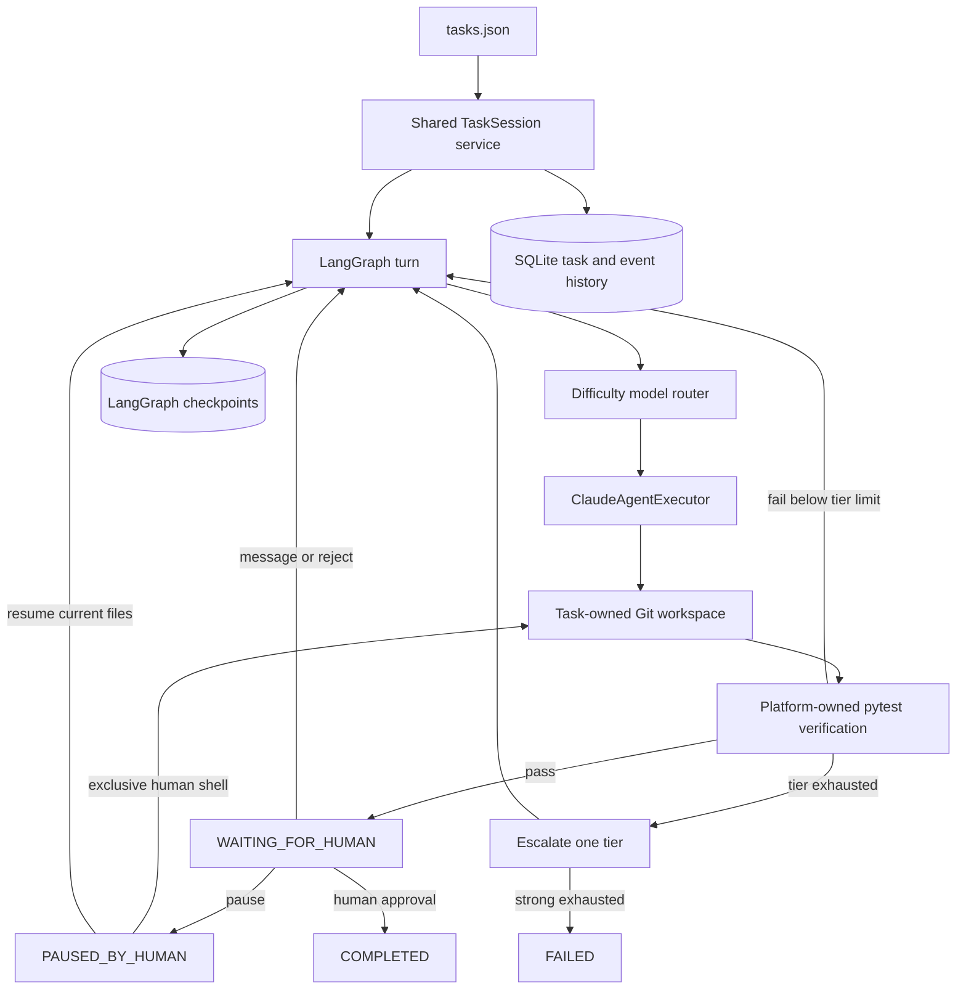

# AI Platform Demo

Platform slash commands are documented in
[`docs/demo25-phase4-commands.md`](docs/demo25-phase4-commands.md). They are deterministic platform
operations shared by the API, CLI, and browser; they are not Claude Code commands.

Demo 2.5 Phase 2 workflow domain behavior is documented in
[`docs/demo25-phase2-domain.md`](docs/demo25-phase2-domain.md).
Demo 2.5 Phase 2.1 model selection and routing is documented in
[`docs/demo25-phase21-model-routing.md`](docs/demo25-phase21-model-routing.md).
Demo 2.5 Phase 2.2 baseline-aware verification is documented in
[`docs/demo25-phase22-verification.md`](docs/demo25-phase22-verification.md).
Demo 2.5 Phase 3 connects that domain model into the real LangGraph phase
workflow (Brainstorm/Plan/Implementation/Review/Human Review, automatic
readiness-gated progression, a fresh independent Review invocation) and is
documented in [`docs/demo25-phase3-workflow.md`](docs/demo25-phase3-workflow.md).

AI Platform Demo is a proof of concept for a shared, persistent, task-owned AI
software-development workflow. Phase 5 deploys the Phase 4 orchestration and
recovery design as a hosted multi-user SSH demonstration.

Demo 2 adds a FastAPI interface and React/TypeScript UI without replacing that
core: Phase 1 is a read-only task view; Phase 2 adds durable browser messaging
that continues the same TaskSession, a background turn runner, and live updates
over SSE; Phase 3 adds the task lifecycle controls; Phase 4 adds authenticated
multi-user collaboration (CLI-provisioned users and tokens, roles, presence) with
database-enforced correctness across API processes. See
[docs/demo2-ui.md](docs/demo2-ui.md) for architecture, API contracts, development
commands, and current limitations.

Demo 2.5 Phase 1 adds administrator-registered local Git templates and browser
task creation. A developer selects a registered repository, its validated base
branch, and an enabled developer assignee; the server generates the task ID and
provisions an isolated workspace before returning success. Existing DEMO-1/2/3
tasks remain file-defined and keep their original lazy-workspace behavior. See
the "Demo 2.5 Phase 1" section of `docs/demo2-ui.md` for commands and contracts.

The central rule is:

```text
one task = one shared TaskSession = one workspace + one append-only history
```

No Docker, web UI, Jira, PostgreSQL, Odoo, pull requests, SSO, or multi-provider
execution is included in this phase.

## Phase 5 - Hosted Multi-User SSH Demo

```text
                         VPS
                          │
              ┌───────────┼───────────┐
              │           │           │
            Vakho       Alex          An
             SSH         SSH          SSH
              │           │           │
              └───────────┼───────────┘
                          │
                     ai-platform CLI
                          │
                    Shared TaskSession
                          │
               /var/lib/ai-platform
                    │            │
                 SQLite      workspace
                                  │
                                Claude
```

Each person has a distinct, non-root Linux account. With `AI_PLATFORM_USER`
unset, the SSH/OS username becomes the durable human `actor_id`. The accounts
share only the trusted `ai-platform` Unix group: application code is
administrator-owned and read-only to that group, while the dedicated runtime
tree is group-writable and setgid. The command wrapper applies `umask 0002`, so
new workspace content remains collaborative without using `777` permissions.

Application code and its shared virtual environment live at
`/opt/ai-platform-demo`. SQLite databases and copied task workspaces live only
under `/var/lib/ai-platform`; runtime state is never written into the checkout.
SQLite database, WAL, SHM, and LangGraph checkpoint files are kept group
read/write. Workspace directories inherit the shared group, use setgid, and
their files are group-writable. Git trust is limited to the administrator-owned
checkout and the three dedicated demo workspaces.

Claude Code authentication is per Unix account because the CLI process that
starts or resumes a turn also starts the Agent SDK. Credentials are never copied
or shared. Each user who will invoke Claude must complete the supported
`claude auth login`; infrastructure-only rehearsal uses `FakeAgentExecutor` in
tests. See `docs/demo-runbook.md` for the exact presentation sequence.

For the frozen Demo 1 deployment, Vakho has external SSH and real Claude
execution. Alex and An have distinct, platform-ready Unix identities and were
validated through server-side simulation; their external SSH access remains
pending public-key installation, and real continuations require their own
Claude logins.

## Phase 4 - Routing and reliability

Task difficulty chooses only the initial tier. Deterministic verification is
evidence: two failures at a tier (configurable) move the task one way from
`cheap` to `default` to `strong`. Strong-tier exhaustion ends in `FAILED` for
human intervention. There are no unbounded loops or automatic downgrades.

```text
LOW -> CHEAP -> failure -> CHEAP RETRY -> failure -> DEFAULT -> PASS
```

This keeps the cheapest model likely to succeed while preserving a bounded path
to stronger models. `MODEL_SELECTED` remains in append-only history;
`MODEL_ESCALATED` records the old/new tier and model, reason, failure count, and
execution ID. Follow-up human turns use the task's current tier, so an escalated
task does not silently return to its difficulty's initial tier.

Each agent turn has a UUID `execution_id`, shared by its attempts, verification,
file, and routing events and by its workspace lease. Global `attempt` remains a
monotonic task counter, while the retry threshold applies per tier within a turn.

## Shared TaskSession collaboration

```text
                       DEMO-1
                          |
                  Shared TaskSession
                  /       |       \
             Vakho       Alex       An
                  \       |       /
                       Claude
                          |
                    same workspace
                          |
                     same history
```

Humans are participants in the task, not owners of private AI sessions. A
`TaskSession` view combines the validated task definition, current SQLite task
record, ordered events, and current Git workspace state. SQLite and the current
workspace remain the source of truth; a forever-running Claude process is not
required.

The reusable `TaskSessionService` owns start, message, pause, shell, resume,
reject, approve, reset, attach, and follow behavior. Typer commands only resolve
identity, call that service, and render the result. A future FastAPI/UI can call
the same core without moving business logic out of the platform package.

## Shared workflow



Every follow-up reconstructs a concise context from durable data: the original
task, acceptance criteria, recent human instructions, recent agent responses,
current verification result, and current Git diff. It starts a fresh bounded
SDK turn in the existing workspace. Although the installed SDK supports session
resume identifiers, platform correctness deliberately does not depend on
provider session retention. Returned SDK session IDs remain useful audit data.

## Human identity

For local Windows development only, set `AI_PLATFORM_USER` independently in
each PowerShell terminal:

```powershell
$env:AI_PLATFORM_USER = "vakho"
ai-platform attach DEMO-1 --follow

$env:AI_PLATFORM_USER = "alex"
ai-platform message DEMO-1 "Check whether the typo appears elsewhere."
```

Without that override, `LocalIdentityProvider` uses the operating-system
username from `getpass.getuser()`. On a later Linux VPS this naturally maps to
the SSH account name. Production identity will instead come from company SSO;
`AI_PLATFORM_USER` is not an authentication or authorization mechanism.

Human events always store `actor_type=human`, the resolved `actor_id`, and a
display name. Participants shown by `attach` are actors observed in durable
history. They are not an online-presence indicator.

## Append-only shared history

Events have an immutable UUID plus a monotonically increasing SQLite
`sequence_id`. Reads and follow mode order by that sequence, even when several
processes write at nearly the same instant. The normal storage API has only
`append_event`; SQLite triggers also reject event updates and deletes.

Phase 3 events include:

```text
HUMAN_CONNECTED          HUMAN_MESSAGE          HUMAN_PAUSED
HUMAN_RESUMED            HUMAN_REJECTED         HUMAN_APPROVED
HUMAN_SHELL_OPENED       HUMAN_SHELL_CLOSED     HUMAN_WORKSPACE_CHANGED
```

They sit in the same history as model selections, agent messages/tool activity,
file changes, verification, retries, status changes, failures, and completion.
New instructions never rewrite old ones.

## One active workspace writer and crash recovery

The `tasks` table contains one durable, atomic workspace lock with a kind,
opaque owner token, actor, process ID, hostname, acquired time, heartbeat,
and execution ID. The two lock kinds are `agent` and `human_shell`.
SQLite `BEGIN IMMEDIATE` plus a conditional update ensures that only one process
can acquire the lock for a task.

Agent turns and human shells refresh their heartbeat every 5 seconds by default.
After 60 seconds without a heartbeat, a lock is only recoverable when its owner
is on this host and the recorded process is demonstrably gone (or legacy state
has no process). A healthy local process is not displaced, and an expired lock
from another host is reported as unverifiable rather than stolen.

Normal completion, failure, timeout, pause, verification errors, and Ctrl+C use
reliable cleanup paths. Every ordinary CLI startup also inspects locks. A
demonstrably stale crashed execution produces `STALE_LOCK_RECOVERED`, clears the
lease, and moves unknown workspace state to `PAUSED_BY_HUMAN`. The human can then
run `diff`, inspect `trace`, and explicitly `resume`. `attach` displays current
lock actor, execution ID, host, PID, timestamps, heartbeat age, and health.

If a second human sends a message while Claude is running, `HUMAN_MESSAGE` is
stored immediately, but another agent is not launched. The CLI explains that
the instruction is available for the next turn. Phase 3 intentionally has no
external queue or background worker.

Database connections use WAL journal mode, a 5-second busy timeout, foreign-key
checks, and short transactions. No transaction is held while Claude, pytest, or
an interactive shell runs.

## Pause, manual takeover, and resume

Pause records the actual human. If there is no active agent, the task moves to
`PAUSED_BY_HUMAN` immediately. If Claude is running, SQLite records
`pause_requested`. `ClaudeAgentExecutor` polls that durable flag and uses the
SDK's streaming `interrupt()` method from the process that owns the client. A
provider that cannot interrupt may finish its current bounded turn, but no
retry or later agent turn starts and the final state is paused. Arbitrary
processes are never killed.

An interactive shell requires the task to be explicitly paused and acquires the
same exclusive workspace lock. The platform chooses `COMSPEC`/`cmd.exe` on
Windows and `SHELL`/`sh` on Unix without invoking a shell to construct commands.

Before and after the shell, Git status plus file-content digests are compared.
Changed paths and practical added/modified/deleted/reverted classifications are
attributed to the human in `HUMAN_WORKSPACE_CHANGED`. Phase 3 does not record
the exact commands typed. A hosted version will need a controlled PTY/session
proxy or OS audit facilities for command-level attribution.

`resume` never recreates or restores the workspace. It tells Claude that humans
may have edited the files and that current files are authoritative, runs again
in that same directory, and independently verifies the result.

## CLI

```powershell
ai-platform tasks
ai-platform doctor
ai-platform show DEMO-1
ai-platform start DEMO-1
ai-platform attach DEMO-1
ai-platform attach DEMO-1 --follow
ai-platform message DEMO-1 "Check whether the typo appears elsewhere."
ai-platform diff DEMO-1
ai-platform trace DEMO-1
ai-platform pause DEMO-1
ai-platform shell DEMO-1
ai-platform resume DEMO-1
ai-platform resume DEMO-1 --message "Review my manual edit and continue."
ai-platform reject DEMO-1 "Please keep the implementation simpler."
ai-platform approve DEMO-1
ai-platform reset DEMO-1
```

`attach --follow` first renders the shared snapshot, then polls SQLite every
350 ms for events whose sequence is newer than its cursor. It renders each event
once, works from multiple processes, uses little CPU, and exits cleanly on
Ctrl+C. No Redis, Kafka, WebSocket, SSE, or external queue is involved.

Approval is accepted only from `WAITING_FOR_HUMAN` after passing platform
verification and when there is no active writer. It records `HUMAN_APPROVED`
with the real actor, followed by system status/completion events.

## Claude preflight and doctor

Before any real workspace is created or agent lock is acquired, the Claude
executor checks that the Agent SDK is installed and inspects the supported
`claude auth status --json` result. A logged-out or expired local session returns
a short platform error with the installed CLI's supported recovery command:

```text
claude auth login
```

Environment credentials are reported as configured but not validated. Invalid
credentials and unavailable model aliases are normalized if the SDK reports
them during execution; preflight and `doctor` do not make a paid model request
just to validate them.

`ai-platform doctor` is read-only with respect to task state. It checks Python,
Git, SQLite, the Claude Agent SDK and CLI, authentication status, configured
model validation limits, task/demo inputs, path writability, an existing
platform database, the Git worktree, and the operating system. It exits nonzero
for required failures and uses warnings for unknown/nonessential state.

## Foundations retained

Starting a task copies `demo_repo/` into `workspaces/<TASK-ID>/`, initializes an
independent `Baseline` Git commit, and never edits the source repository. An
existing workspace is never overwritten. Reset deletes only that validated task
workspace, restores runtime fields to `READY`, and retains all history.

Initial difficulty routing remains configuration-driven:

| Difficulty | Tier | Default Claude alias |
| --- | --- | --- |
| `low` | `cheap` | `haiku` |
| `medium` | `default` | `sonnet` |
| `high` | `strong` | `opus` |

The Claude executor uses the official `claude-agent-sdk`, the selected model,
the task workspace as `cwd`, an explicit tool list, bounded turns, and a wall
clock timeout. Authentication comes from supported Claude Code/Agent SDK
mechanisms or an optional `ANTHROPIC_API_KEY`. Credentials and hidden reasoning
are never stored in platform events.

Each task has a structured pytest target. Claude may run tests, but the platform
always invokes its own bounded `python -m pytest ...` command with `shell=False`.
A failed verification is returned to the next attempt in the same workspace.
The per-tier attempt count and escalation progression are bounded.

## Setup

Python 3.12 or newer is required. From Windows PowerShell:

```powershell
cd ai-platform-demo
python -m venv .venv
.\.venv\Scripts\Activate.ps1
python -m pip install --upgrade pip
python -m pip install -e ".[dev]"
```

Copy `.env.example` to `.env` only for intentional local overrides. `.env`,
credentials, SDK state, databases, workspaces, and caches are ignored by Git.

For a standalone Linux development host, after cloning the repository:

```sh
cd ai-platform-demo
python3 -m venv .venv
. .venv/bin/activate
python -m pip install -e .
claude auth login
ai-platform doctor
ai-platform tasks
```

Alternatively, `scripts/setup_linux.sh` checks Python 3.12+, creates the virtual
environment, installs the package, creates only configured runtime directories,
and runs `doctor`. It performs no `sudo`, user, SSH, firewall, service, or secret
configuration. Phase 5 must choose a shared Unix group and restrictive group
ownership/permissions for the install, data directory, workspaces, and SQLite
files before exposing the CLI to multiple SSH users; `777` permissions are not
recommended.

## Configuration

| Variable | Default |
| --- | --- |
| `AI_PLATFORM_TASK_FILE` | `tasks.json` |
| `AI_PLATFORM_DEMO_REPO` | `demo_repo/` |
| `AI_PLATFORM_DATA_DIR` | `data/` |
| `AI_PLATFORM_WORKSPACE_ROOT` | `workspaces/` |
| `AI_PLATFORM_DB_PATH` | `data/platform.db` |
| `AI_PLATFORM_CHECKPOINT_DB_PATH` | `data/langgraph-checkpoints.db` |
| `AI_PLATFORM_EXECUTOR` | `claude` |
| `AI_PLATFORM_CHEAP_MODEL` | `haiku` |
| `AI_PLATFORM_CLAUDE_SONNET_MODEL` | `sonnet` |
| `AI_PLATFORM_CLAUDE_OPUS_MODEL` | `opus` |
| `AI_PLATFORM_AGENT_TIMEOUT_SECONDS` | `300` |
| `AI_PLATFORM_AGENT_MAX_TURNS` | `8` |
| `AI_PLATFORM_VERIFICATION_TIMEOUT_SECONDS` | `60` |
| `AI_PLATFORM_MAX_ATTEMPTS_PER_TIER` | `2` |
| `AI_PLATFORM_LOCK_HEARTBEAT_SECONDS` | `5` |
| `AI_PLATFORM_LOCK_STALE_SECONDS` | `60` |
| `AI_PLATFORM_USER` | OS username (development only) |
| `ANTHROPIC_API_KEY` | unset |

## Tests

Automated tests use `FakeAgentExecutor`; they never invoke real Claude:

```powershell
pytest
ruff check .
```

Coverage includes initial routing, deterministic cheap/default escalation,
strong exhaustion, continuation without downgrade, execution IDs, healthy and
stale locks, heartbeat refresh, audited crash recovery, portable configuration,
read-only diagnostics, clean auth failure, identity resolution, actor attribution, multi-human shared
history, append-only deterministic event order, follow cursors, concurrent
SQLite/CLI writers, one active agent turn, pause behavior, shell exclusion and
Git change attribution, same-workspace resume, rejection, approval, and source
repository integrity. Phase 3 adds the phase-aware LangGraph pipeline: the
happy path reaching Human Review in one turn, each read-only phase's gate
stopping and rerunning with feedback, bounded Implementation failure as a gate
stop (not FAILED), Review findings at each severity, read-only enforcement
(an unexpected workspace mutation fails a phase's gate closed), and per-phase
model routing (`tests/test_phase3_pipeline.py`).

The clean source under `demo_repo/` intentionally contains the three regression
tasks. Run that red baseline only when desired with `pytest demo_repo/tests`.

## Current limitations

- Local copied workspaces are logical isolation, not a security sandbox.
- Lease recovery is intentionally single-host and conservative. Expired locks
  owned by a different host or an unverifiable process require operator review.
- The heartbeat is a SQLite lease for this demo, not a distributed consensus
  or fencing-token system.
- Messages received during an active turn are durable but do not start an
  automatic queued worker turn.
- Shell attribution is file-level Git state, not exact command auditing.
- SQLite polling is suitable for this CLI/SSH demo, not the later hosted UI.
- Environment credential/model availability cannot be proven without a real
  provider request; `doctor` reports that uncertainty.
- There is no SSO, RBAC, service manager, PR creation, or production-grade
  authorization policy.
- Every Unix user who invokes Claude needs their own supported Claude login;
  Phase 5 does not introduce a central execution daemon.

A hosted UI and production sandbox remain separate later phases.
