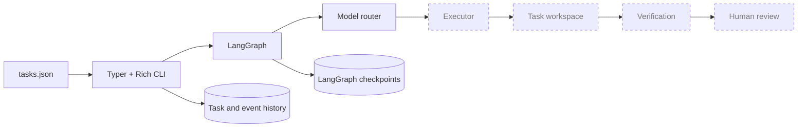
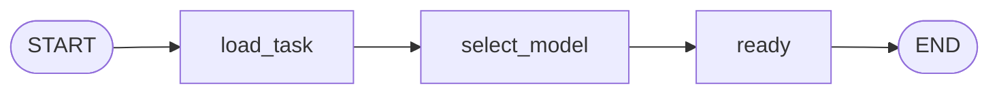

# AI Platform Demo

AI Platform Demo is a small proof of concept for a shared, persistent,
task-owned AI software-development workflow. This repository contains the
foundation only: a task source, CLI, minimal LangGraph workflow, model-tier
router, local workspace interface, and durable SQLite history.

No model provider is called yet. In particular, `ai-platform start` selects and
records a model tier, then stops explicitly before code execution.

## Why this first demo is deliberately small

Demo 1 substitutes lightweight local components for the eventual production
systems:

| Production concern | Demo 1 substitute |
| --- | --- |
| Jira | `tasks.json` |
| Production sandbox | Local Python workspace |
| PostgreSQL | SQLite |
| Hosted UI | CLI |
| Company authentication | Later SSH/Linux users |
| Multi-model provider system | Initial model-tier router |

Docker, a web UI, Jira, Odoo, PostgreSQL, SSH, multi-user coordination, and the
Claude coding executor are intentionally out of scope for this foundation.

## Architecture



The solid foundation currently runs `tasks.json → CLI → LangGraph → model
router`, with independent SQLite files for product audit history and LangGraph
checkpoints. The dashed stages are clean extension points, not simulated
features.

The current graph is intentionally minimal:



The task ID is the LangGraph `thread_id`, making later task-session resumption a
natural extension.

## Windows setup

Python 3.12 or newer is required. From Windows PowerShell:

```powershell
cd ai-platform-demo
py -3.12 -m venv .venv
.\.venv\Scripts\Activate.ps1
python -m pip install --upgrade pip
python -m pip install -e ".[dev]"
```

If PowerShell blocks local activation scripts, use this process-scoped setting
and activate again:

```powershell
Set-ExecutionPolicy -Scope Process -ExecutionPolicy Bypass
.\.venv\Scripts\Activate.ps1
```

Copy `.env.example` to `.env` only when local overrides are needed. `.env` and
runtime databases are ignored by Git.

## CLI

```powershell
ai-platform tasks
ai-platform show DEMO-1
ai-platform start DEMO-1
ai-platform trace DEMO-1
```

`start` creates durable runtime state, records lifecycle events, runs the
minimal graph, records the selected tier/model/reason, and returns the task to
`READY`. It does not claim that code was changed.

Initial routing is deliberately predictable:

| Difficulty | Model tier |
| --- | --- |
| `low` | `cheap` |
| `medium` | `default` |
| `high` | `strong` |

Provider model IDs are configured centrally through environment variables so
later model changes do not leak into routing logic. A later escalation policy
can promote repeated verification failures from cheap to default and then
strong without changing the task schema.

## Configuration

All path settings accept absolute paths or paths relative to the repository:

| Variable | Default |
| --- | --- |
| `AI_PLATFORM_DATA_DIR` | `data/` |
| `AI_PLATFORM_WORKSPACE_ROOT` | `workspaces/` |
| `AI_PLATFORM_DB_PATH` | `data/platform.db` |
| `AI_PLATFORM_CHECKPOINT_DB_PATH` | `data/langgraph-checkpoints.db` |
| `AI_PLATFORM_CHEAP_MODEL` | Unconfigured cheap placeholder |
| `AI_PLATFORM_DEFAULT_MODEL` | Unconfigured default placeholder |
| `AI_PLATFORM_STRONG_MODEL` | Unconfigured strong placeholder |
| `ANTHROPIC_API_KEY` | Unset; reserved for the future executor |

`platform.db` owns task runtime state and append-only audit events.
`langgraph-checkpoints.db` owns graph checkpoints. Keeping them separate makes
their responsibilities and later migrations explicit.

## Tests and intentionally failing demo tasks

The platform foundation has a green quality gate:

```powershell
pytest
ruff check .
```

The application under `demo_repo/` deliberately contains the three bugs from
`tasks.json`. Its regression suite is kept outside the platform test path so a
normal `pytest` run validates the foundation. Run it explicitly to demonstrate
the known red baseline:

```powershell
pytest demo_repo/tests
```

Before any coding executor is implemented, that command is expected to report
three failing regression tests: the welcome typo, the 5% discount, and the
inconsistent display name. The passing discount boundary test documents the
behavior that DEMO-2 must preserve.

## Repository layout

```text
ai-platform-demo/
├── demo_repo/              # Tiny, deliberately broken target application
│   ├── app/
│   └── tests/              # Explicit red-baseline regression suite
├── src/ai_platform/
│   ├── executors/base.py   # Future executor protocol only
│   ├── cli.py
│   ├── config.py
│   ├── events.py
│   ├── graph.py
│   ├── models.py
│   ├── router.py
│   ├── storage.py
│   ├── task_loader.py
│   └── workspace.py
├── tests/                  # Green platform foundation suite
├── .env.example
├── pyproject.toml
└── tasks.json
```

## Linux deployment notes

No deployment is performed in Demo 1. The code avoids Windows-specific paths,
so a later Linux VPS can use the same repository and configuration:

```bash
python3.12 -m venv .venv
source .venv/bin/activate
python -m pip install -e '.[dev]'
ai-platform tasks
```

Set `AI_PLATFORM_DATA_DIR` and `AI_PLATFORM_WORKSPACE_ROOT` to durable,
writable VPS paths. Back up both SQLite databases consistently. Multi-user
locking, SSH identity mapping, service supervision, and sandbox isolation must
be designed before treating the VPS as a shared production service.

## Progression

- **Demo 1:** CLI + LangGraph + Claude + SQLite + local workspace
- **Demo 2:** FastAPI + React + real-time event stream
- **Production:** Jira + SSO + isolated sandboxes + Odoo environment + provider
  routing

The recommended next task is a narrow Claude executor implementation behind
`TaskExecutor`: copy `demo_repo` into a task workspace, propose a patch for one
task, run only its deterministic tests, record file/test events, and stop at
human review. That work is intentionally not part of this foundation.
