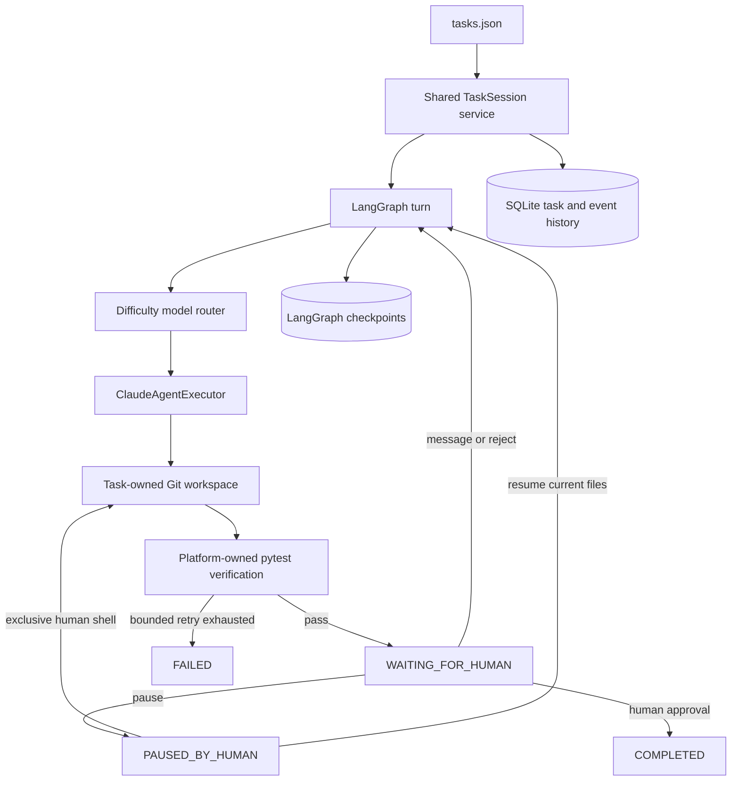

# AI Platform Demo

AI Platform Demo is a proof of concept for a shared, persistent, task-owned AI
software-development workflow. Phase 3 adds human collaboration around the real
Claude Agent SDK workflow built in Phase 2.

The central rule is:

```text
one task = one shared TaskSession = one workspace + one append-only history
```

No Docker, web UI, Jira, SSH provisioning, PostgreSQL, Odoo, pull requests,
SSO, or multi-provider execution is included in this phase.

## Phase 3 - Shared TaskSession collaboration

```text
                       DEMO-1
                          |
                  Shared TaskSession
                  /       |       \
             Vakho       Alex     David
                  \       |       /
                       Claude
                          |
                    same workspace
                          |
                     same history
```

Humans are participants in the task, not owners of private AI sessions. A
`TaskSession` view combines the validated task definition, current SQLite task
record, ordered events, and current Git workspace state. SQLite and the current
workspace remain the source of truth; a forever-running Claude process is not
required.

The reusable `TaskSessionService` owns start, message, pause, shell, resume,
reject, approve, reset, attach, and follow behavior. Typer commands only resolve
identity, call that service, and render the result. A future FastAPI/UI can call
the same core without moving business logic out of the platform package.

## Shared workflow



Every follow-up reconstructs a concise context from durable data: the original
task, acceptance criteria, recent human instructions, recent agent responses,
current verification result, and current Git diff. It starts a fresh bounded
SDK turn in the existing workspace. Although the installed SDK supports session
resume identifiers, platform correctness deliberately does not depend on
provider session retention. Returned SDK session IDs remain useful audit data.

## Human identity

For local Windows development only, set `AI_PLATFORM_USER` independently in
each PowerShell terminal:

```powershell
$env:AI_PLATFORM_USER = "vakho"
ai-platform attach DEMO-1 --follow

$env:AI_PLATFORM_USER = "alex"
ai-platform message DEMO-1 "Check whether the typo appears elsewhere."
```

Without that override, `LocalIdentityProvider` uses the operating-system
username from `getpass.getuser()`. On a later Linux VPS this naturally maps to
the SSH account name. Production identity will instead come from company SSO;
`AI_PLATFORM_USER` is not an authentication or authorization mechanism.

Human events always store `actor_type=human`, the resolved `actor_id`, and a
display name. Participants shown by `attach` are actors observed in durable
history. They are not an online-presence indicator.

## Append-only shared history

Events have an immutable UUID plus a monotonically increasing SQLite
`sequence_id`. Reads and follow mode order by that sequence, even when several
processes write at nearly the same instant. The normal storage API has only
`append_event`; SQLite triggers also reject event updates and deletes.

Phase 3 events include:

```text
HUMAN_CONNECTED          HUMAN_MESSAGE          HUMAN_PAUSED
HUMAN_RESUMED            HUMAN_REJECTED         HUMAN_APPROVED
HUMAN_SHELL_OPENED       HUMAN_SHELL_CLOSED     HUMAN_WORKSPACE_CHANGED
```

They sit in the same history as model selections, agent messages/tool activity,
file changes, verification, retries, status changes, failures, and completion.
New instructions never rewrite old ones.

## One active workspace writer

The `tasks` table contains one durable, atomic workspace lock with a kind,
owner, and start time. The two lock kinds are `agent` and `human_shell`.
SQLite `BEGIN IMMEDIATE` plus a conditional update ensures that only one process
can acquire the lock for a task.

If a second human sends a message while Claude is running, `HUMAN_MESSAGE` is
stored immediately, but another agent is not launched. The CLI explains that
the instruction is available for the next turn. Phase 3 intentionally has no
external queue or background worker.

Database connections use WAL journal mode, a 5-second busy timeout, foreign-key
checks, and short transactions. No transaction is held while Claude, pytest, or
an interactive shell runs.

## Pause, manual takeover, and resume

Pause records the actual human. If there is no active agent, the task moves to
`PAUSED_BY_HUMAN` immediately. If Claude is running, SQLite records
`pause_requested`. `ClaudeAgentExecutor` polls that durable flag and uses the
SDK's streaming `interrupt()` method from the process that owns the client. A
provider that cannot interrupt may finish its current bounded turn, but no
retry or later agent turn starts and the final state is paused. Arbitrary
processes are never killed.

An interactive shell requires the task to be explicitly paused and acquires the
same exclusive workspace lock. The platform chooses `COMSPEC`/`cmd.exe` on
Windows and `SHELL`/`sh` on Unix without invoking a shell to construct commands.

Before and after the shell, Git status plus file-content digests are compared.
Changed paths and practical added/modified/deleted/reverted classifications are
attributed to the human in `HUMAN_WORKSPACE_CHANGED`. Phase 3 does not record
the exact commands typed. A hosted version will need a controlled PTY/session
proxy or OS audit facilities for command-level attribution.

`resume` never recreates or restores the workspace. It tells Claude that humans
may have edited the files and that current files are authoritative, runs again
in that same directory, and independently verifies the result.

## CLI

```powershell
ai-platform tasks
ai-platform show DEMO-1
ai-platform start DEMO-1
ai-platform attach DEMO-1
ai-platform attach DEMO-1 --follow
ai-platform message DEMO-1 "Check whether the typo appears elsewhere."
ai-platform diff DEMO-1
ai-platform trace DEMO-1
ai-platform pause DEMO-1
ai-platform shell DEMO-1
ai-platform resume DEMO-1
ai-platform resume DEMO-1 --message "Review my manual edit and continue."
ai-platform reject DEMO-1 "Please keep the implementation simpler."
ai-platform approve DEMO-1
ai-platform reset DEMO-1
```

`attach --follow` first renders the shared snapshot, then polls SQLite every
350 ms for events whose sequence is newer than its cursor. It renders each event
once, works from multiple processes, uses little CPU, and exits cleanly on
Ctrl+C. No Redis, Kafka, WebSocket, SSE, or external queue is involved.

Approval is accepted only from `WAITING_FOR_HUMAN` after passing platform
verification and when there is no active writer. It records `HUMAN_APPROVED`
with the real actor, followed by system status/completion events.

## Phase 2 foundations retained

Starting a task copies `demo_repo/` into `workspaces/<TASK-ID>/`, initializes an
independent `Baseline` Git commit, and never edits the source repository. An
existing workspace is never overwritten. Reset deletes only that validated task
workspace, restores runtime fields to `READY`, and retains all history.

Difficulty routing remains configuration-driven:

| Difficulty | Tier | Default Claude alias |
| --- | --- | --- |
| `low` | `cheap` | `haiku` |
| `medium` | `default` | `sonnet` |
| `high` | `strong` | `opus` |

The Claude executor uses the official `claude-agent-sdk`, the selected model,
the task workspace as `cwd`, an explicit tool list, bounded turns, and a wall
clock timeout. Authentication comes from supported Claude Code/Agent SDK
mechanisms or an optional `ANTHROPIC_API_KEY`. Credentials and hidden reasoning
are never stored in platform events.

Each task has a structured pytest target. Claude may run tests, but the platform
always invokes its own bounded `python -m pytest ...` command with `shell=False`.
A failed verification is returned for one configured retry in the same
workspace.

## Setup

Python 3.12 or newer is required. From Windows PowerShell:

```powershell
cd ai-platform-demo
python -m venv .venv
.\.venv\Scripts\Activate.ps1
python -m pip install --upgrade pip
python -m pip install -e ".[dev]"
```

Copy `.env.example` to `.env` only for intentional local overrides. `.env`,
credentials, SDK state, databases, workspaces, and caches are ignored by Git.

## Configuration

| Variable | Default |
| --- | --- |
| `AI_PLATFORM_DATA_DIR` | `data/` |
| `AI_PLATFORM_WORKSPACE_ROOT` | `workspaces/` |
| `AI_PLATFORM_DB_PATH` | `data/platform.db` |
| `AI_PLATFORM_CHECKPOINT_DB_PATH` | `data/langgraph-checkpoints.db` |
| `AI_PLATFORM_EXECUTOR` | `claude` |
| `AI_PLATFORM_CHEAP_MODEL` | `haiku` |
| `AI_PLATFORM_DEFAULT_MODEL` | `sonnet` |
| `AI_PLATFORM_STRONG_MODEL` | `opus` |
| `AI_PLATFORM_AGENT_TIMEOUT_SECONDS` | `300` |
| `AI_PLATFORM_AGENT_MAX_TURNS` | `8` |
| `AI_PLATFORM_VERIFICATION_TIMEOUT_SECONDS` | `60` |
| `AI_PLATFORM_MAX_ATTEMPTS` | `2` |
| `AI_PLATFORM_USER` | OS username (development only) |
| `ANTHROPIC_API_KEY` | unset |

## Tests

Automated tests use `FakeAgentExecutor`; they never invoke real Claude:

```powershell
pytest
ruff check .
```

Coverage includes identity resolution, actor attribution, multi-human shared
history, append-only deterministic event order, follow cursors, concurrent
SQLite/CLI writers, one active agent turn, pause behavior, shell exclusion and
Git change attribution, same-workspace resume, rejection, approval, and source
repository integrity.

The clean source under `demo_repo/` intentionally contains the three regression
tasks. Run that red baseline only when desired with `pytest demo_repo/tests`.

## Current limitations

- Local copied workspaces are logical isolation, not a security sandbox.
- A process crash can leave a durable workspace lock requiring an explicit
  operator reset/recovery procedure; lease recovery is deferred.
- Messages received during an active turn are durable but do not start an
  automatic queued worker turn.
- Shell attribution is file-level Git state, not exact command auditing.
- SQLite polling is suitable for this CLI/SSH demo, not the later hosted UI.
- There is no SSO, RBAC, remote deployment, PR creation, or model escalation.

The recommended next phase is model routing/escalation and stronger recovery
semantics around the same TaskSession core. A hosted UI and production sandbox
should remain separate later phases.
